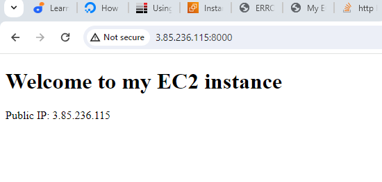
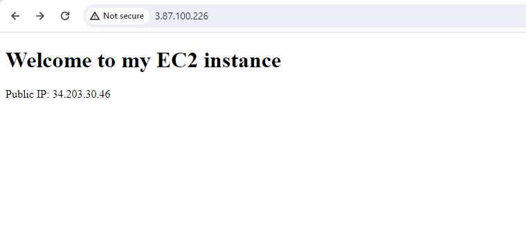
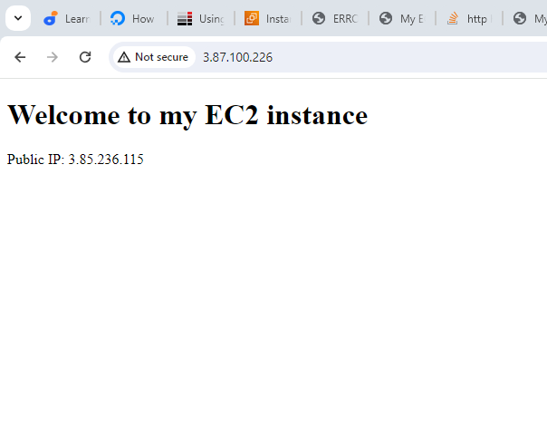

# Loadbalancing-with-Nginx
# Load Balancing with Nginx
Load balancing with Nginx involves distributing incoming network traffic across multiple servers to ensure optimal resource utilization, maximize throughput, minimize response time, and avoid server overload. Nginx acts as a load balancer, efficiently managing requests and distributing them among a group of backend servers, improving the overall performance and reliability of a web application

## Launch two EC2 instance and install Apche2 in the two instance
EC2s are used to configure virtual servers in the cloud. These virtual servers, known as instances, can be used for various applications, including hosting websites, running applications, and processing data.

## Edit inbound rules of the two instance for port 8000
Inbound rules control incoming traffic to EC2 instances. The rules are configured within the associated security groups, which act as virtual firewalls for the created instances. Each rule specifies the allowed sources, IP addresses, and protocols for incoming traffic. Protocol:TCP,  Port range:80, Source: Private IP address of mysql client. Source -0.0.0.0/0 at Port range:80 allowing traffic from any source at port 80.
in this case we use port 8000 for both instance

## ssh -i "linux.pem" ubuntu@ec2-3-87-100-226.compute-1.amazonaws.com 
 
is majorly use to connect a terminal through SSH to an Amazon EC2 instance.
Ssh : Command to initiate an SSH connection, -I  
‘’linux.pem’’’ : Specifies the private key file (in this case, "linux.pem") to use for, 
‘ubuntu’ : The username you are using to log in to the EC2 instance. 
For Amazon, ec2-3-87-100-226.compute-1.amazonaws.com, the public DNS or IP address of your EC2 instance. Its compulsory that the ssh key file is in the same directory in which the SSH command is run.

## Sudo apt update
Sudo apt update is used on Debian-based Linux systems, such as Ubuntu, to update the local package index. This command does not upgrade the installed packages but retrieves information about the latest versions of packages available from the repositories configured on your system.

## Install Apache
Install Apache2 with the command, sudo apt install apache2. The command is used to install Apache2 web server on an Ubuntu system using the advanced package tool ‘apt’. 

after installation, its necessary to start (sudo service apache2 start ) and check (sudo service apache2 status) Apache2 status. The check confirms if apache has been installed successfully and running or not. 

For further confirmation, open a web browser and enter the server's IP address or domain name. If everything is set up correctly, you should see the default Apache2 welcome page

Another way to confirm is to run curl http://localhost . This command is used to make an HTTP request to the local web server running on your machine. It's a way to test if the server is responding and to see the raw output.

## Add a new Listening Directive

Through the vim editor, this command opens  the ports.conf file. This file is used to configure the ports that Apache listens on

## Default Apache Host Configuiration

this command opens the default Apache Virtual Host configuration file in the vi text editor with elevated privilege (sudo). Here, we change the port to 8000, in line with the new listen port, 8000.

After making any changes to the 000-default.conf file, its necessary to restart Apache for the changes to take effect. sudo service apache2 restart is Apache2 restart command

## Edith index.html file

The command sudo vi index.html opens the index .html file . The simple HTML file welcomes users to my EC2 instance

## Change index.html file ownership

This command changes the ownership of the index.html file to the user and group ‘www-data’. This is a common practice on many web servers, Apache inclusive. This is often done to ensure that the web server (in this case, Apache) has the necessary permissions to read and serve the file. Apache should have the necessary permissions to serve the index.html file after changing the ownership. Its compulsory to make sure the file is in the correct directory specified in Apache configuration.

## Copy index file to Var/www/html/

this command copies the index.html file to var/www/html/ directory and also overwrite any index.html file existing in that location. the contents of index.html file should be available at the root of the web server after running this command. Through the IP address, users accessing the server will see this page but before proceeding to the url, its necessary to restart Apache2.

Now proceed to the url and type the ip address on the url

### First EC2 instance IP

### Second EC2 instance IP

NOW Launch the third EC2 instance for the loadbalancer: Nginx

Edit Nginx inbound rule and add Port 80.

Run the update and install command 

'sudo apt update -y && sudo apt install nginx -y'

sudo apt update -y  updates the local package index on your Ubuntu system. The -y flag is used to automatically answer "yes" to prompts, allowing the update to proceed without manual confirmation. ‘&&’ is a shell operator that allows you to run multiple commands sequentially. The second command will only be executed if the first one succeeds.
Sudo apt install nginx –y  installs the Nginx web server. Similar to the update command, the -y flag automatically answers "yes" to any prompts during the installation process
Alternatively, the two command can be run differently.

Remember to confirm nginx is active and running.

##  Edith the load balancer file

This command opens a ‘loadbalancer.cof’ file for editing using the vi editor. This file is typically used to configure Nginx settings for load balancing . After updating the configuration, its advisable to save the file and restart Nginx.

## Confirm nginxsyntax

Sudo nginx –t command is used to test the syntax of your Nginx configuration files. This command checks for syntax errors and other issues in the configuration without actually restarting the Nginx service. If there are no syntax errors or other issues in your Nginx configuration files, it gives an output indicating that the configuration test is successful. If there are any errors, the command will provide information about the specific issues, allowing you to correct them before restarting Nginx. It's always a good practice to run the command after making changes to your Nginx configuration to ensure that the changes are valid before applying them

Now proceed to the url and type Nginx server IPaddred on the url

Take note of the IP on the url and the chage in IP address in the text

